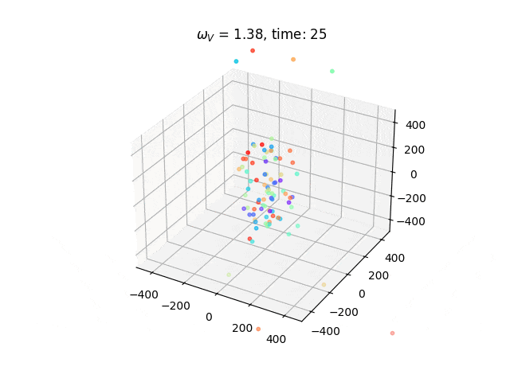

# Project 3 - FYS4150 <!-- omit in toc -->

- [Introduction](#introduction)
- [Installation](#installation)
- [Plots](#plots)
- [Animations](#animations)
- [Information about data structure](#information-about-data-structure)

## Introduction
This is project 3 for FYS4150 at the university of Oslo for the fall of 2024. 
We simulate the Penning trap. 


## Installation
Compiled with `c++17`.

Changes in the simulation are done in src/simulate_penning.cpp exclusively. 
There are comments to illustrate how to do this in the file.
Command for running src/simulate_penning.cpp is saved to the file run.sh.
On Unix, you can therefore compile with `clang` or `g++` by using the following command while located in the code_p3 directory:

```bash
./run.sh
```

### Plots
All plots are generated in the plotting.ipynb file, including animations of the Penning trap. 

### Animations
Animations are available in the animations folder.


### Information about data structure

Units: 

Length: micrometre (µm)

Time: microseconds (µs)

Mass: atomic mass unit (u)

Charge: the elementary charge (e)


File structure for simulations in txt:

#particles #timesteps
t0
P1x P1y P1z P1Vx P1Vy P1Vz
P2x P2y P2z P2Vx P2Vy P2Vz
...
t1
P1x P1y P1z P1Vx P1Vy P1Vz
P2x P2y P2z P2Vx P2Vy P2Vz
.
.
.
tn
P1x P1y P1z P1Vx P1Vy P1Vz
P2x P2y P2z P2Vx P2Vy P2Vz

e.g.

23 100
0.0
1.0 2.0 3.0 0.4 0.5 0.6
0.7 0.8 0.9 1.0 1.1 1.2
0.0 0.0 0.0 0.0 0.0 0.0
0.01
1.1 2.0 3.0 0.4 0.5 0.6
0.7 0.8 0.9 1.0 1.1 1.2
0.0 0.0 0.0 0.0 0.0 0.0
